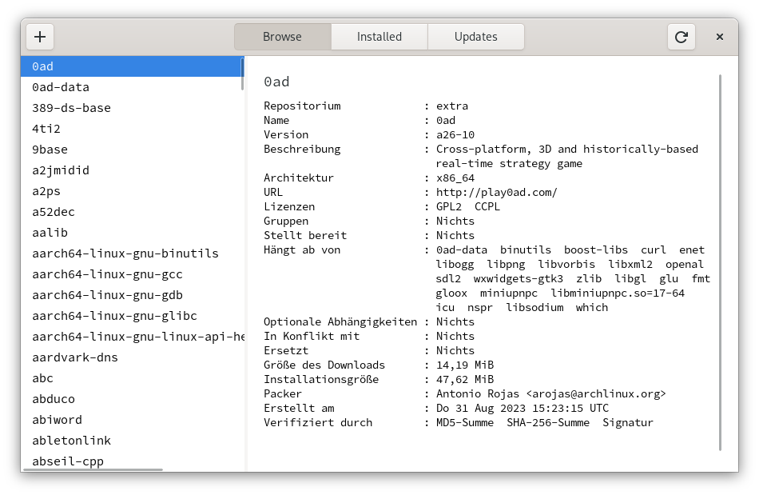
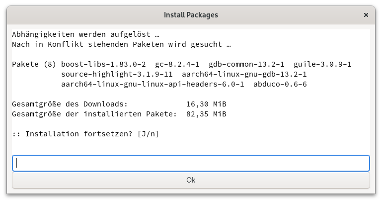

# PacCheckGTK beta
Easy and Lite Pacman Frontend written in Python3.

PacCheck is a lightweight and user-friendly frontend for the Pacman package manager. It was created using Python and the GTK toolkit to provide an appealing and easy-to-navigate user interface. With PacCheck, users can install, remove, and update packages with just a few clicks, without requiring in-depth knowledge of terminal commands.

